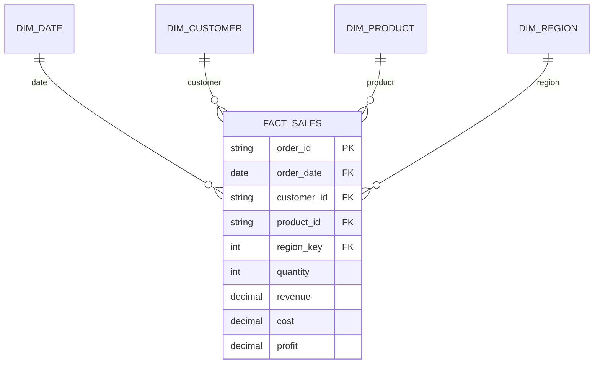

# Data Model

## Grain
One row in `FactSales` represents one order-line transaction in the generated portfolio dataset. The grain must remain stable before defining DAX measures; mixing order-level and line-level rows would produce incorrect counts and averages.

## Star Schema

## Why a star schema?
- Keeps numeric measures in a central fact table.
- Avoids repeating descriptive product/region attributes throughout the analytical model.
- Produces simple one-to-many relationships for Power BI.
- Makes filter propagation easier to reason about.
- Supports reusable DAX measures across date, product, customer and geography dimensions.

## Power BI Relationship Guidance
Use one-to-many, single-direction relationships from each dimension to `FactSales`. Mark `DimDate` as the date table before using time-intelligence measures.

## Data Quality Contract
Before refresh, validate uniqueness of order identifiers, positive quantities/prices, discount range, profit reconciliation and dimension-key integrity. See `sql/02_data_quality.sql`.
